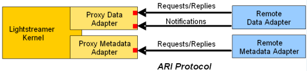

# Lightstreamer "Hello World" Adapter for Sockets #

This is the third projects in a series aimed at illustrating how to develop Lightstreamer Adapters based on various technologies:

- [Lightstreamer "Hello World" Adapter for Java](https://github.com/Weswit/Lightstreamer-example-HelloWorld-adapter-java): An introduction to Lightstreamer's data model, Java Data Adapters, and Server deployment, through the development of a very basic "Hello World" application.
- [Lightstreamer "Hello World" Adapter for .NET](https://github.com/Weswit/Lightstreamer-example-HelloWorld-adapter-dotnet): The .NET version of the Data Adapter used in the "Hello World" application, showing both a C# and a Visual Basic port.

In this third installment, will show a <b>Data Adapter</b> that communicates with the Lightstreamer Server through plain <b>TCP sockets</b>, instead of leveraging higher level abstractions as did with the Java API and the .NET API.<br>
The rationale for this is to enable the development of Data Adapters based on technologies other than Java and .NET. This way, it is possible to inject real-time updates into Lightstreamer Server from programs written in <b>C, PHP, Ruby,</b> or any other language that allows client <b>TCP socket programming</b>.

## The Architecture ##

On the client side, we will keep the same exact HTML front-end used in the two previous installments. For an explanation of the HTML/JavaScript code, please see the ["Hello World" with Lightstreamer Colosseo](https://github.com/Weswit/Lightstreamer-example-HelloWorld-client-javascript) project.<br>

On the <b>server side</b>, we will leverage the <b>Lightstreamer Adapter Remoting Infrastructure</b> (ARI):



This is the same architecture used in the [.NET example](https://github.com/Weswit/Lightstreamer-example-HelloWorld-adapter-dotnet), but in this case the Remote Data Adapter is not a .NET application, but any process that opens two sockets with the Proxy Data Adapter and implements the ARI Protocol over TCP. As in the previous examples, we will not code a custom Metadata Adapter, but will use a default one. So the Remote Metadata Adapter will not be present.<br>

Let's recap. On the server side, this new example will be comprised of:

- <b>Proxy Data Adapter</b>: A ready-made Data Adapter, based on Java, which is provided as part of the Adapter Remoting Infrastructure (available in the free and commercial distributions of Lightstreamer Server).
- <b>Remote Data Adapter</b>: The subject of this article ...
- <b>LiteralBasedProvider</b>: A ready-made Metadata Adapter, based on Java, which is provided as part of all the free and commercial distributions of Lightstreamer Server. The LiteralBasedProvider replaces the Proxy Metadata Adapter in the diagram above.

So, what about the <b>Remote Data Adapter</b>? We could implement it in any language that supports socket programming, but in this article we will do something more interactive, which does not require any programming. We will use a very normal telnet client to connect to the Proxy Data Adapter and will manually play the ARI Network Protocol.<br>
Should be fun ...

The Proxy Data Adapter listens on two TCP ports and the Remote Data Adapter has to create two sockets. One socket is used for interactions based on a <b>request/response</b> paradigm (this is a <i>synchronous channel</i>). The other socket is used to deliver <b>asynchronous events</b> from the Remote Adapter to the Proxy Adapter (this is an <i>asynchronous channel</i>). Therefore, our Remote Data Adapter will be comprised of two telnet windows.

## Setting Up the System ##

If you didn't already do it in the previous installments, download and install the [latest release of Lightstreamer Moderato](http://www.lightstreamer.com/download).

Now, let's deploy the Adapter pair (Proxy Data Adapter + LiteralBasedProvider) in a new folder. Go to the "adapters" folder of your Lightstreamer Server installation. You could already have a "StockList" folder (containing a pre-installed demo Adapter), plus a "HelloWorld" and a "ProxyHelloWorld" folders (if you followed the previous two articles). In any case, you don't need these three folders, as we are going to create a new one for this example.  Let's call this new folder (created inside "adapters") "<b>ProxyHelloWorldSockets</b>". Then create a "strong>lib" folder inside "ProxyHelloWorldSockets" and copy the "<b>ls-proxy-adapters.jar</b>" file from "Lightstreamer/DOCS-SDKs/sdk_adapter_remoting_infrastructure/lib" to "Lightstreamer/adapters/ProxyHelloWorldSockets/lib".

Create a new file in "Lightstreamer/adapters/ProxyHelloWorldSockets", call it "adapters.xml", and use the following contents:

```xml
<?xml version="1.0"?>
<adapters_conf id="PROXY_HELLOWORLD_SOCKETS">
 
  <metadata_provider>
    <adapter_class>com.lightstreamer.adapters.metadata.LiteralBasedProvider</adapter_class>
  </metadata_provider>
 
  <data_provider>
    <adapter_class>com.lightstreamer.adapters.remote.data.NetworkedDataProvider</adapter_class>
      <param name="request_reply_port">7001</param>
      <param name="notify_port">7002</param>
      <param name="timeout">36000000</param>
  </data_provider>
 
</adapters_conf>
```

We have chosen TCP port <b>7001</b> for the request/response channel and TCP port <b>7002</b> for the asynchronous channel. Feel free to use different ports if such numbers are already used on your system.

Notice the "<b>timeout</b>" parameter. It sets the maximum time the Proxy Adapter will wait for a response from the Remote Adapter after issuing a request. The default value is 10 seconds, but in this case the Remote Adapter is played by humans, so I have configured a very high value (10 hours), to do relaxed experiments without the pressure of any timeouts.

Finally, let's deploy the simple Web resources. Create a "<b>HelloWorldSockets</b>" folder under the "Lightstreamer/pages" folder. Put in this new folder the "index.htm" file available from this project (the page is very similar to those of two previous articles; we just changed the Adapter name to "PROXY_HELLOWORLD_SOCKETS" and added the .setRequestedSnapshot("yes") line to always get the current state of the fields). Now we have to deploy the JavaSscript libraries used by our page. Let's create an "LS" folder under "HelloWorldSockets" and copy to it all the files located in "Lightstreamer/DOCS-SDKs/sdk_client_web/lib". For further details on the page deployment, please see [this project](https://github.com/Weswit/Lightstreamer-example-HelloWorld-client-javascript).

## Let's Play ##

Start Lightstreamer Server from a command or shell window (I will call this the "<b>log window</b>"). You should see something like this:

```cmd
[...]
30.ott.13 17:07:22,227 < INFO> Lightstreamer Server 5.1.1 build 1623.2
30.ott.13 17:07:22,286 < INFO> Lightstreamer Server starting in Moderato edition.
30.ott.13 17:07:22,346 < WARN> Only minimal JMX management support is available with the current license.
30.ott.13 17:07:22,444 < INFO> Started RMI server for JMX on port 8888.
30.ott.13 17:07:22,525 < INFO> Bound RMI Connector for JMX on port 8888 (communication on port 8888).
30.ott.13 17:07:22,568 < INFO> Bound RMI Connector for Platform mbeans on port 8888 (communication on port 8888).
30.ott.13 17:07:22,574 < INFO> SERVER pool size set by default at 10.
30.ott.13 17:07:22,696 < INFO> data_provider element without name attribute; using DEFAULT as the default name.
30.ott.13 17:07:22,699 < INFO> Loading Data Adapter PROXY_HELLOWORLD_SOCKETS.DEFAULT
30.ott.13 17:07:22,699 < INFO> Loading Metadata Adapter PROXY_HELLOWORLD_SOCKETS
30.ott.13 17:07:22,706 < INFO> Finished loading Metadata Adapter PROXY_HELLOWORLD_SOCKETS
30.ott.13 17:07:22,736 < INFO> Connecting...
30.ott.13 17:07:22,740 < INFO> Waiting for a connection on port 7002...
30.ott.13 17:07:22,741 < INFO> Waiting for a connection on port 7001...
.
```

The Server is waiting for the "PROXY_HELLOWORLD_SOCKETS" Remote Data Adapter to connect to the two TCP ports we specified above (7001 and 7002). The Server initialization will complete only when these connections succeed.

Now open other two command or shell windows.<br>
In the first one (which I will call the "<b>request/response window</b>") type:
```cmd
  telnet localhost 7001
```
In the second one (which I will call the "<b>async window</b>") type:
```cmd
  telnet localhost 7002
```

Promptly, the Server will try to initialize our Remote Data Adapter; this will cause a request to be issued in the request/response window, similar to the following:
```cmd
  10000014209a460b9|DPI|S|data_provider.name|S|DEFAULT|S|adapters_conf.id|S|PROXY_HELLOWORLD_SOCKETS
```

The first string is the unique ID of that request and will change every time. We must confirm the successful initialization; we can do this by typing the following string in the <i>request/response window</i> and hitting Enter:
```cmd
  10000014209a460b9|DPI|V
```

<i>Note: Replace "10000014209a460b9" with the actual ID you received, otherwise the initialization will not succeed and you will see a warning in the log window.</i>

The Server initialization will complete and in the log window you should see something like this:

```cmd
[...]
30.ott.13 17:07:22,227 < INFO> Lightstreamer Server 5.2 a4 build 1648
30.ott.13 17:07:22,286 < INFO> Lightstreamer Server starting in Moderato edition.
30.ott.13 17:07:22,346 < WARN> Only minimal JMX management support is available with the current license.
30.ott.13 17:07:22,444 < INFO> Started RMI server for JMX on port 8888.
30.ott.13 17:07:22,525 < INFO> Bound RMI Connector for JMX on port 8888 (communication on port 8888).
30.ott.13 17:07:22,568 < INFO> Bound RMI Connector for Platform mbeans on port 8888 (communication on port 8888).
30.ott.13 17:07:22,574 < INFO> SERVER pool size set by default at 10.
30.ott.13 17:07:22,696 < INFO> data_provider element without name attribute; using DEFAULT as the default name.
30.ott.13 17:07:22,699 < INFO> Loading Data Adapter PROXY_HELLOWORLD_SOCKETS.DEFAULT
30.ott.13 17:07:22,699 < INFO> Loading Metadata Adapter PROXY_HELLOWORLD_SOCKETS
30.ott.13 17:07:22,706 < INFO> Finished loading Metadata Adapter PROXY_HELLOWORLD_SOCKETS
30.ott.13 17:07:22,736 < INFO> Connecting...
30.ott.13 17:07:22,740 < INFO> Waiting for a connection on port 7002...
30.ott.13 17:07:22,741 < INFO> Waiting for a connection on port 7001...
30.ott.13 17:07:47,368 < INFO> Connected on port 7001
30.ott.13 17:08:02,448 < INFO> Connected on port 7002
30.ott.13 17:08:02,450 < INFO> Connected
30.ott.13 17:08:02,451 < INFO> Finished loading Data Adapter PROXY_HELLOWORLD_SOCKETS.DEFAULT
30.ott.13 17:08:02,465 < INFO> Selector pool size set by default at 8.
30.ott.13 17:08:02,466 < INFO> Selector maximum load set by default at 1000.
30.ott.13 17:08:02,758 < INFO> Notify receiver '#1' starting...
30.ott.13 17:08:02,763 < INFO> Request sender '#1' starting...
30.ott.13 17:08:02,764 < INFO> Events pool size set by default at 8.
30.ott.13 17:08:02,765 < INFO> Reply receiver '#1' starting...
30.ott.13 17:08:02,779 < INFO> Pump pool size set by default at 8.
30.ott.13 17:08:02,795 < INFO> Lightstreamer on Java Virtual Machine: Sun Microsystems Inc., Java HotSpot(TM) 64-Bit Server VM, 20.5-b03, 1.6.0_30-b12 on Windows 7
30.ott.13 17:08:02,796 < INFO> Lightstreamer Server 5.2 a4 build 1648 starting...
30.ott.13 17:08:02,811 < INFO> Server "Lightstreamer HTTP Server" listening to *:8080 ...
.
```

Now we are ready to interact with the Server.

Let's connect a client to activate a subscription. Open a <b>browser window</b> and go to: http://localhost:8080/HelloWorldSockets.
In the log window you will see some information regarding the HTTP interaction between the browser and the Lightstreamer Server.

In the browser window you will see:
```cmd
loading...
loading...
```
The "<b>greetings</b>" item has been subscribed to by the Client, with a schema comprised of the "<b>message</b>" and "<b>timestamp</b>" fields. The Server has then subscribed to the same item through our Remote Adapter (due to the fact that Lightstreamer Server is based on a "Publish On-Demand" paradigm). This subscription will manifest itself as a request in the request/response window, similar to the following:
```cmd
  20000014209a460b9|SUB|S|greetings
```

Let's respond saying that we accept such subscription. We can do this by typing the following string in the <i>request/response window</i> and hitting Enter:
```cmd
  20000014209a460b9|SUB|V
```

<i>Note: Again, replace "20000014209a460b9" with the actual ID you received.</i>

Our Remote Data Adapter has now accepted to serve events on the "greetings" item. It's time to inject some events by hand, through the async window. With most telnet applications you will not see anything will typing in the async window, so it is better to use copy and paste. Paste the following string, then hit Enter:
```cmd
  0|UD3|S|greetings|S|20000014209a460b9|B|0|S|timestamp|S|Now is the time|S|message|S|Hello socket world!
```
<i>Note: Make sure to paste everything on a single line. And, of course, replace "20000014209a460b9" with the actual ID you received.</i>

Now look at the browser window and enjoy the results of this effort:
```cmd
  Hello socket world!
  Now is the time
```

We can push more events on the "greetings" item, leveraging the same two fields ("message" and "timestamp") ans sending arbitrary data. For example, paste this in the async window (always on a single line and replacing the ID):
```cmd
  0|UD3|S|greetings|S|20000014209a460b9|B|0|S|message|S|What do you call a fish with no eyes?|S|timestamp|S|A fsh
```

## The Network Protocol ##

In the examples above we scratched the surface of the ARI Network Protocol. By delving into deeper details, you will see that it is quite straightforward. The full specification is available in the "ARI Protocol.pdf" document, you can find it [here](http://www.lightstreamer.com/latest/Lightstreamer_Allegro-Presto-Vivace_5_1_Colosseo/Lightstreamer/DOCS-SDKs/sdk_adapter_remoting_infrastructure/doc/ARI%20Protocol.pdf).<br>

The Remote Data Adapter can only receive two synchronous requests: <b>subscribe</b> and <b>unsubscribe</b>. It can send three asynchronous events: <b>update, end of snapshot,</b> and <b>failure</b>.
The Remote Metadata Adapter (which was not covered in this article) can receive more synchronous requests, as its interface is a bit more complex than the Data Adapter, but it does not send any asynchronous events at all (in fact it uses one TCP socket only).

## Final Notes ##

In reality, of course, you will never implement a "human-driven" Adapter as we did in this article, but this approach was useful, from a didactive perspective, to illustrate the basic principles of the Lightstreamer Adapter Remoting Infrastructure (ARI). If you need to develop an Adapter based on technologies other than Java and .NET, the ARI makes the trick.

Should you develop any Adapter in <b>PHP, Ruby, Python , Perl</b>, or any other language, feel free to let us know, by posting a comment here on the [Lightstreamer Forums](http://forums.lightstreamer.com/).

# See Also #

## Clients using this Adapter ##

* ["Hello World" with Lightstreamer Colosseo](https://github.com/Weswit/Lightstreamer-example-HelloWorld-client-javascript)

## Related projects ##

* [Lightstreamer "Hello World" Adapter for Java](https://github.com/Weswit/Lightstreamer-example-HelloWorld-adapter-java)
* [Lightstreamer "Hello World" Adapter for .NET](https://github.com/Weswit/Lightstreamer-example-HelloWorld-adapter-dotnet)

# Lightstreamer Compatibility Notes #

- Compatible with Lightstreamer Adapter Remoting Infrastructure (Proxy Adapters) version 1.6 or newer.
- Compatible with Lightstreamer JavaScript Client Library version 6.0 or newer.